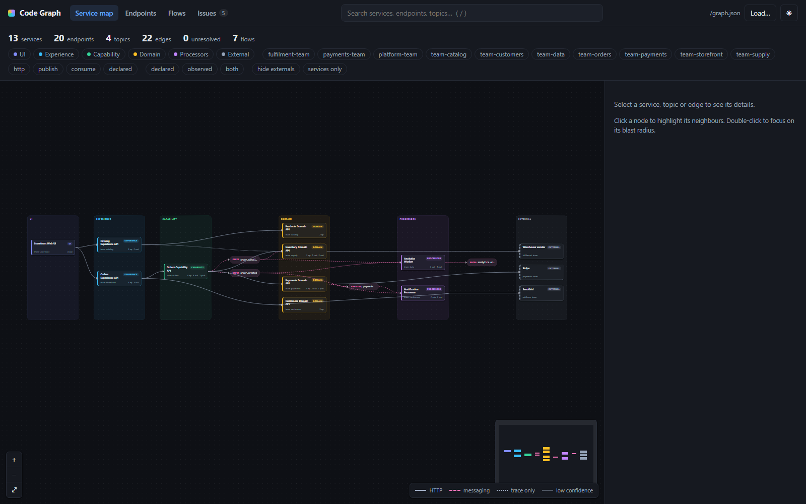
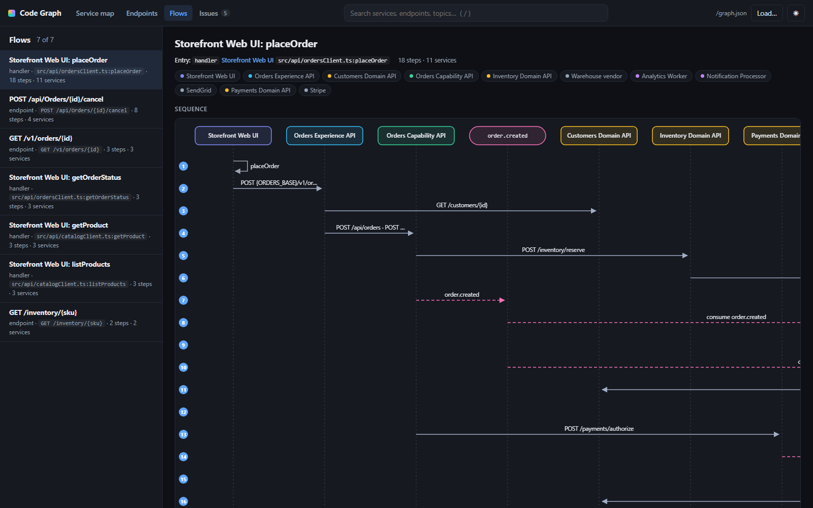
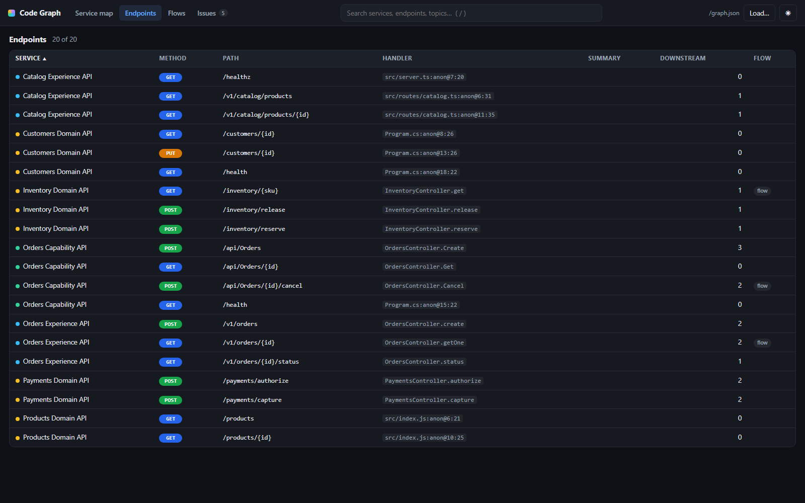

# code-graph

Extract, aggregate and explore application flows across a fleet of services: UI → experience API → capability API → domain API, plus Kafka / RabbitMQ handlers and external systems.

Nothing is hand-written. Each repo runs a static extractor in GitHub Actions that emits a small manifest. A central catalog repo aggregates the manifests into a graph, derives end-to-end flows, merges observed edges from tracing, generates docs, and publishes an interactive explorer to GitHub Pages. AI (GitHub Copilot or Claude) is used only to name flows and summarise handlers, on changed code only, with caching.

```
 app repo (x30)                        catalog repo                             outputs
 ┌──────────────────┐  Actions  ┌───────────────────────────┐  Actions   ┌──────────────────────┐
 │ codegraph.yaml   │ ────────► │ manifests/<service>.json  │ ─────────► │ graph.json           │
 │ source code      │  npx      │ codegraph.aggregate.yaml  │  aggregate │ docs/*.md + Mermaid  │
 └──────────────────┘ extractor │ traces/service-graph.json │  enrich    │ explorer on Pages    │
                                └───────────────────────────┘            └──────────────────────┘
```

Everything runs on plain **npm** and **GitHub Actions**. Developers interact through `codegraph.yaml`, PR comments, Copilot prompt files, and the explorer site.

## What is in this repo

| Path | What it is |
|---|---|
| `packages/schema` | The contract: `ServiceManifest` (what one repo emits) and `Graph` (what the aggregator produces), with a validator. |
| `packages/extractor` | `codegraph-extract <repo>`: tree-sitter static analysis for C#, Java, TypeScript and JavaScript. Detects ASP.NET Core, Spring, Express and NestJS endpoints; HttpClient, Refit, RestTemplate, WebClient, Feign, fetch and axios calls; Kafka and RabbitMQ consumers and publishers; and the intra-service handler call graph. |
| `packages/aggregator` | `codegraph-aggregate`: resolves call targets, builds topic nodes, derives flows, merges traces, writes `graph.json` and Markdown/Mermaid docs. `codegraph-diff`: compares two manifests for PR comments. |
| `packages/enrich` | `codegraph-enrich`: AI summaries and flow names via the GitHub Copilot SDK (uses Copilot seats) or the Anthropic SDK. Sends handler slices only, caches by content hash. |
| `packages/ui` | Vite + React + React Flow explorer: layered service map, blast radius, endpoint explorer, flow sequence diagrams, issues. |
| `packages/cli` | `codegraph scan|serve|open`: one command that extracts every repo under a directory, aggregates, and serves the explorer locally. No CI or catalog needed. |
| `samples/` | A ten-service fake estate across all layers and languages, used by tests and the demo. |
| `templates/app-repo/` | Files to copy into each application repo: workflow, `codegraph.yaml`, `.npmrc`, Copilot instructions and prompt files. |
| `templates/catalog-repo/` | Files for the central catalog repo: site workflow, aggregate config, README. |
| `scripts/set-scope.mjs` | Renames the `@codegraph` npm scope to your GitHub org before publishing. |

## Try it locally in five minutes

Requires Node 22.12+ and npm 10+. No other tooling.

```bash
npm install
npm run build                 # compiles every package
npm test                      # 24 tests across schema, extractor, aggregator, enrich
npm run extract:samples       # samples/* → out/manifests/*.json
npm run aggregate:samples     # → out/graph.json, out/docs/, packages/ui/public/graph.json
npm run ui:dev                # open http://localhost:5173
```

What you should see: 13 services (10 from manifests + 3 external systems), 20 endpoints, 4 topics, 12 HTTP edges, 7 flows, and one deliberate drift warning where the sample trace export shows a call that is not in code.







## Try it on your own repos (no CI needed)

```bash
npm run build
node packages/cli/dist/cli.js open C:/src            # or: npx @codegraph/cli open ~/src once published
```

`codegraph open` finds every git repo (or any folder with a `codegraph.yaml`) up to two levels under the roots you give it, extracts each one in-process, aggregates, writes `codegraph-out/{manifests,graph.json,docs}`, and opens the explorer at http://127.0.0.1:4173. Repos without `codegraph.yaml` get inferred ids and layers; unresolved calls are printed with file and line so you know which `targets` entries to add. Pass `--config` for a shared `codegraph.aggregate.yaml` and `--traces` for a tracing export.

Optional AI enrichment of the demo graph (Copilot CLI login, `COPILOT_GITHUB_TOKEN`, or `ANTHROPIC_API_KEY`):

```bash
npm run enrich:samples -- --dry-run     # shows the requests and rough token counts, sends nothing
npm run enrich:samples                  # ~10 small requests, cached by handler hash afterwards
npm run aggregate:samples -- --enrichment ../../out/enrichment
```

## Rolling it out in your organisation

Do these once, in order.

### Step 1: Publish the tooling (platform team, once)

1. Push this repo to GitHub under your org, for example `your-org/code-graph`.
2. Run `node scripts/set-scope.mjs your-org` so packages are named `@your-org/extractor` and so on (GitHub Packages requires the scope to equal the org). Commit the result.
3. Tag a release: `git tag v0.1.0 && git push --tags`. The `release` workflow publishes all packages to GitHub Packages. The `ci` workflow builds, tests and runs the sample pipeline on every PR.

### Step 2: Create the catalog repo (platform team, once)

1. Create `your-org/codegraph-catalog` and copy everything from `templates/catalog-repo/` into it.
2. Edit `codegraph.aggregate.yaml` for cross-cutting rules (external vendors, trace service-name mappings). Per-service mappings belong in each app's `codegraph.yaml`, not here.
3. Enable GitHub Pages with source "GitHub Actions" in the repo settings.
4. Optional secrets: `COPILOT_GITHUB_TOKEN` (a token with Copilot access; enables AI enrichment on your Copilot seats) or `ANTHROPIC_API_KEY`. Optional `CODEGRAPH_READ_TOKEN` with read access to app repos if you want handler summaries, plus a `repos.txt` listing them. Without any of these the graph and docs still build; flows keep their structural names.
5. Optional: export your tracing backend's service dependencies into `traces/service-graph.json` (Jaeger `/api/dependencies` shape, or `[{source,target}]`). This confirms static edges and surfaces calls to systems outside your domain.

### Step 3: Onboard each application repo (app teams, ~15 minutes per repo)

1. Copy `templates/app-repo/.npmrc`, `templates/app-repo/.github/` and `templates/app-repo/codegraph.yaml` into the repo.
2. In VS Code with Copilot, run the prompt `/codegraph-onboard`. It fills in `codegraph.yaml` (service id, layer, owner, and a `targets` entry for every outbound call it finds), runs the extractor, and reports anything unresolved. Review and commit. Without Copilot, fill the file by hand following `.github/instructions/codegraph.instructions.md` and run `npx @your-org/extractor . --out manifest.json --verbose`.
3. Add the repo secret `CODEGRAPH_CATALOG_TOKEN` (fine-grained PAT or GitHub App token with contents:write on the catalog repo) and the repo variable `CODEGRAPH_CATALOG_REPO=your-org/codegraph-catalog`.
4. Merge. From now on every push to `main` publishes `manifests/<service-id>.json` to the catalog, and every pull request gets a sticky comment listing added or removed endpoints, consumers, outbound calls and publishes.

### Step 4: Keep it accurate (ongoing)

- When a PR comment or the explorer's Issues view shows `call:unresolved`, run `/codegraph-resolve` in Copilot. It traces the URL to its config key and adds the `targets` entry with evidence.
- Dependencies that code cannot reveal (shared SDKs, sidecars) go in `declaredDependencies` with a reason.
- The catalog site rebuilds on every manifest change and weekly, so trace drift and enrichment stay current.
- To add a framework or language, add a plugin in `packages/extractor/src/plugins/` or a frontend in `src/frontends/`, extend the samples, and add a test.

## Deploying the explorer (PCF, Pages, or any static host)

The explorer is a static single-page app with no backend. At startup it fetches one file, `graph.json`, from the folder it was served from (or from `?graph=<url>` if given), builds an in-memory model, and renders everything client-side. So a deployment is just a folder: the built bundle plus `graph.json`, optionally with the generated docs under `/docs`.

`codegraph package` assembles that folder and adds what Cloud Foundry needs:

```bash
npm run build                                # once; builds the explorer bundle
npm run extract:samples && npm run aggregate:samples
node packages/cli/dist/cli.js package --graph out/graph.json --docs-dir out/docs --site site --app-name codegraph-explorer
cf push -f site/manifest.yml -p site         # staticfile buildpack, 64M, rolling deploy
```

What ends up in `site/`:

| File | Purpose |
|---|---|
| `index.html`, `assets/` | The explorer bundle, built with a relative base so it works at any route or sub-path. |
| `graph.json` | The aggregated graph. Served with `Cache-Control: no-store` so users always see the latest deploy. |
| `docs/` | Optional Markdown + Mermaid docs for download. |
| `manifest.yml` | Cloud Foundry app manifest: `staticfile_buildpack`, memory, instances, app name. |
| `Staticfile`, `nginx/conf/includes/codegraph.conf` | Buildpack config: HTTPS redirect, no directory listing, cache headers. |
| `Staticfile.auth` | Only with `--htpasswd <file>`: basic auth for the whole site (generate the file with `htpasswd -nb user pass`). |

Keeping it current: the catalog workflow (`templates/catalog-repo/.github/workflows/codegraph-site.yml`) already runs `codegraph package` after every aggregation and uploads the folder as an artifact. Its `pcf` job pushes the folder with the CF CLI whenever these are configured on the catalog repo: secrets `CF_API`, `CF_USERNAME`, `CF_PASSWORD` (use a service account), variables `CF_ORG`, `CF_SPACE`, and optionally `CF_APP_NAME` and secret `CODEGRAPH_HTPASSWD`. Every manifest change then produces a fresh `graph.json` and a rolling redeploy with zero downtime. The same job can target GitHub Pages instead, or both.

If you prefer the data to update without redeploying the app, host `graph.json` elsewhere (a bucket, an internal file server) and link to the explorer with `?graph=https://.../graph.json`. The page fetches it with `no-store`, so the host needs CORS to allow the explorer's origin.

## How the pieces fit

- **Manifests are the asset.** Small, reviewable JSON, produced by CI from the code that owns it. Everything else is derived and can be regenerated.
- **Resolution is layered.** `codegraph.yaml` targets beat catalog config beat hint matching beat path matching. Every edge carries `resolution` and `confidence`; every miss becomes an issue with a file and line.
- **Flows are structural first.** The aggregator follows the handler call graph through resolved calls and topic subscriptions without any model. AI adds names and prose, so the graph is correct with enrichment off.
- **AI cost is bounded.** Inputs are manifest facts plus handler source slices, never files or repos. Results are cached by handler hash, so a one-method change re-sends one method. With Copilot there is no extra vendor bill; with Anthropic the Batch API halves the price.
- **Traces are ground truth.** Static edges seen in traces become `both`; trace-only edges become `observed` and are flagged as drift; static edges never observed are listed too.

## Limitations

- Static detection is pattern based. Dynamic routing, URLs built far from the call site, and unusual client wrappers surface as `call:unresolved` issues rather than guesses.
- Python, Go, Kotlin and gRPC are not supported yet. The plugin shape makes them additive.
- The trace importer works at service granularity. Span-level import would allow endpoint-level observed edges.
- The extractor prunes handlers that are neither entry points nor on a path to an outbound effect; pass `--no-prune` to keep them.
